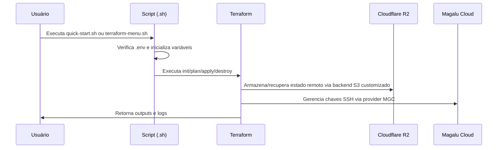
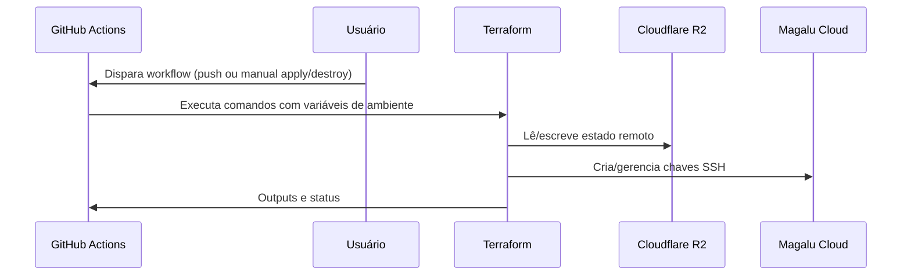

# Terraform SSH Keys Management - Magalu Cloud

Este projeto configura e gerencia chaves SSH na Magalu Cloud usando Terraform com CI/CD via GitHub Actions.

---

---

## 🔧 Pré-requisitos

1. **Conta na Magalu Cloud** com acesso às credenciais de APIs.
2. **Bucket no Cloudflare R2** para armazenar o state do Terraform e credenciais da Cloudflare.
3. **Secrets adicionadas** para utilização do Github Actions.

## Contato

Para dúvidas ou reporte de vulnerabilidades, consulte o [SECURITY.md](SECURITY.md).

---