```mermaid
sequenceDiagram
    participant Usuário
    participant Script (.sh)
    participant Terraform
    participant Cloudflare R2
    participant Magalu Cloud

    Usuário->>Script (.sh): Executa quick-start.sh ou terraform-menu.sh
    Script (.sh)->>Script (.sh): Verifica .env e inicializa variáveis
    Script (.sh)->>Terraform: Executa init/plan/apply/destroy
    Terraform->>Cloudflare R2: Armazena/recupera estado remoto via backend S3 customizado
    Terraform->>Magalu Cloud: Gerencia chaves SSH via provider MGC
    Terraform->>Usuário: Retorna outputs e logs
```

```mermaid
sequenceDiagram
    participant GitHub Actions
    participant Usuário
    participant Terraform
    participant Cloudflare R2
    participant Magalu Cloud

    Usuário->>GitHub Actions: Dispara workflow (push ou manual apply/destroy)
    GitHub Actions->>Terraform: Executa comandos com variáveis de ambiente
    Terraform->>Cloudflare R2: Lê/escreve estado remoto
    Terraform->>Magalu Cloud: Cria/gerencia chaves SSH
    Terraform->>GitHub Actions: Outputs e status
```

# Terraform SSH Keys Management - Magalu Cloud

Este projeto configura e gerencia chaves SSH na Magalu Cloud usando Terraform com CI/CD via GitHub Actions.

---

---

## 🔧 Pré-requisitos

1. **Conta na Magalu Cloud** com acesso às credenciais de APIs.
2. **Bucket no Cloudflare R2** para armazenar o state do Terraform e credenciais da Cloudflare.
3. **Secrets adicionadas** para utilização do Github Actions.

## Contato

Para dúvidas ou reporte de vulnerabilidades, consulte o [SECURITY.md](SECURITY.md).

---