```mermaid
sequenceDiagram
    participant GitHub Actions
    participant Usuário
    participant Terraform
    participant Cloudflare R2
    participant Magalu Cloud

    Usuário->>GitHub Actions: Dispara workflow (push ou manual apply/destroy)
    GitHub Actions->>Terraform: Executa comandos com variáveis de ambiente
    Terraform->>Cloudflare R2: Lê/escreve estado remoto
    Terraform->>Magalu Cloud: Cria/gerencia chaves SSH
    Terraform->>GitHub Actions: Outputs e status
```

# Terraform SSH Keys Management - Magalu Cloud

Este projeto configura e gerencia chaves SSH na Magalu Cloud usando Terraform com CI/CD via GitHub Actions.

---

---

## 🔧 Pré-requisitos

1. **Conta na Magalu Cloud** com acesso às credenciais de APIs.
2. **Bucket no Cloudflare R2** para armazenar o state do Terraform e credenciais da Cloudflare.
3. **Secrets adicionadas** para utilização do Github Actions.

## Requirements

| Name                                                                         | Version |
| ---------------------------------------------------------------------------- | ------- |
|  [cloudflare](#requirement\_cloudflare) | ~> 4    |
|  [local](#requirement\_local)                | 2.5.2   |
|  [mgc](#requirement\_mgc)                      | 0.33.0  |

## Providers

No providers.

## Modules

| Name                                                                         | Source                                        | Version |
| ---------------------------------------------------------------------------- | --------------------------------------------- | ------- |
|  [mgc\_ssh\_keys](#module\_mgc\_ssh\_keys) | github.com/terraform-mgc-modules/mgc-ssh-keys | v2.0.0  |

## Resources

No resources.

## Inputs

| Name                                                                                                  | Description                   | Type     | Default                              | Required |
| ----------------------------------------------------------------------------------------------------- | ----------------------------- | -------- | ------------------------------------ | :------: |
|  [cloudflare\_account\_id](#input\_cloudflare\_account\_id) | ID da conta Cloudflare        | `string` | `"4839c9636a58fa9490bbe3d2e686ad98"` |    no    |
|  [cloudflare\_api\_token](#input\_cloudflare\_api\_token)    | Token de API da Cloudflare    | `string` | n/a                                  |   yes    |
|  [mgc\_api\_key](#input\_mgc\_api\_key)                               | API Key para autenticação     | `string` | n/a                                  |   yes    |
|  [mgc\_key\_id](#input\_mgc\_key\_id)                                  | ID da chave do objeto         | `string` | n/a                                  |   yes    |
|  [mgc\_key\_secret](#input\_mgc\_key\_secret)                      | Segredo da chave do objeto    | `string` | n/a                                  |   yes    |
|  [r2\_access\_key](#input\_r2\_access\_key)                         | ID da chave de acesso R2      | `string` | n/a                                  |   yes    |
|  [r2\_access\_secret](#input\_r2\_access\_secret)                | Segredo da chave de acesso R2 | `string` | n/a                                  |   yes    |
|  [ssh\_key\_name](#input\_ssh\_key\_name)                            | Nome da chave SSH             | `string` | `"nataliagranatodeassis"`            |    no    |
|  [ssh\_key\_value](#input\_ssh\_key\_value)                         | Valor da chave SSH            | `string` | n/a                                  |   yes    |

## Outputs

| Name                                                                            | Description               |
| ------------------------------------------------------------------------------- | ------------------------- |
|  [ssh\_key\_name](#output\_ssh\_key\_name)    | Nome da chave SSH criada  |
|  [ssh\_key\_value](#output\_ssh\_key\_value) | Valor da chave SSH criada |

## Contato

Para dúvidas ou reporte de vulnerabilidades, consulte o [SECURITY.md](SECURITY.md).

---